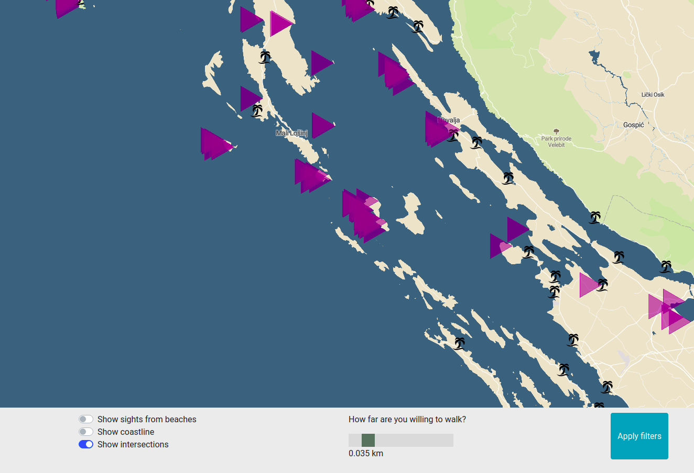

# Coastr

This application works with beaches in Croatia. Original idea was to show only beaches where you can enjoy sunset while looking at open water view. What was done:
- defining view from beaches
- counting intersection with coastline
- show beaches on map
- filter walking distance in order to see open view

It looks like this:



The application has 2 separate parts, the client which is a [frontend web application](#frontend) using mapbox API and mapbox gl js and the [backend application](#backend) written in [Python Flask](https://www.palletsprojects.com/p/flask/), backed by PostGIS. The frontend application communicates with backend using a [REST API](#api) using GeoJSON.

# Frontend

The frontend application is a static HTML page (`index.html`), it is rendered by Flask engine after requesting default root `localhost:5000/`. Page shows mapbox map and some filters. I slightly modified style so that water is more dark.

There are 3 checkboxes and one slider with button.
* Show sights from beaches - shows view polygons representing human view when he would stand on the beach
* Show coastline - shows coastline border
* Show intersections - shows polygon views for beaches that has view on open sea 

I have been developing with Vue.js and vuemapbox component, however there were 2 major bugs and I decided to leave Vue and use plain html, js(jQuery), css and some help from Bootstrap. This is the reason there is `frontend` folder. Vue application is placed here. It left it there just for future work (this project is interesting :slightly_smiling_face:)

Frontend files are thus found under `backend` folder:
* `templates/`: html file is stored here
* `static/`: css, js and media are stored here

Frontend's `show_intersection` is main functionality of this app. If checkbox is checked, slider and "apply" button is available to use as well. This functionality is further described in [Solution](#solution) 

# Backend

I wrote backend in Python-Flask with the help of flask-sqlalchemy library. 
Backend exposes Rest API and sends GeoJSON's as answers for get requests. Backend makes raw queries to db, SQL Injection protection is solved with flask-sqlalchemy db engine.

## Data

I downloaded snapshot of Croatia OSM data. Then I used command `osm2pgsql` to import data to PostGIS. I faced one problem with import troughout the whole semester. I was not able to find `natural=coastline` attribute in my data. Finally, solution was while importing to use flag `--keep-coastline` for a reason. 

For optimization sake I created 2 new tables:
* beach_view - holds information about beaches in Croatia, its name, way and *sight view* polygon (triangle on showcase picture)
* spatial_coast - holds information about coast, aggregates tag `natural=coastline` from `planet_osm_line` and `planet_osm_polygon`

Both tables have GIST indexes on attributes holding geo position information.

## Solution for intersections

Intersection works like this:
* iterate over beaches
* for each beach create view polygon by moving left for about 4.5km (counted by globe curving)
* sine and tang was used to count sides of triangle, however after counting first one I extracted constants and now these constants are being added to the point so that the algorithm do not need to count functions each time
* there was a problem with situations where points intersected with coastline on just a little and algorithm thus marked that beach as not able to see sunset. It solved this issue with function ST_Maxdistance that give me the farest distance between beach and coastline. If it is small number I consider that beach as able, if not beach is not able.
* This constant is changable with slideron frontend (needs to be applied with button)

## Api

**Get frontend served with beaches on map**

`GET http://localhost:5000/`

**Show coastline**

`GET http://localhost:5000/api/get_coastline`
returns GeoJSON

**Show view sight**
`GET http://localhost:5000/api/get_coastline`
returns GeoJSON

**Show intersections - open beaches**
`GET http://localhost:5000/api/get_intersetions`
returns GeoJSON

**Show beaches**
`GET http://localhost:5000/api/get_beaches`
returns GeoJSON
*called implicitly after map is loaded*

### Response from beaches endpoint

All endpoint returns geojson in similiar form to this:
```
{
  "id": "beaches", 
  "type": "FeatureCollection", 
  "features": [
    {
      "type": "Feature", 
      "properties": {
        "name": null
      }, 
      "geometry": {
        "type": "Point", 
        "coordinates": [
          13.9070370980641, 
          44.7860727950407
        ]
      }
    },...
```

# Query examples

Create views from beaches

```sql
with beaches as (
    select name, osm_id, tags,
           ST_X(st_astext(way)) as longitude,
           ST_Y(st_astext(way)) as latitude
    from planet_osm_point
    where "natural" = 'beach'
    union all
    select name, osm_id, tags,
           st_x(st_astext(st_centroid(way)))
               as longitude,
           st_y(st_astext(st_centroid(way)))
               as latitude
    from planet_osm_polygon
    where "natural" = 'beach'
)

select name, osm_id, tags,
       st_polygon(st_makeline(ARRAY [
           st_point(longitude, latitude),
           st_point(longitude - 0.057635373, latitude - 0.02385071216053),
           st_point(longitude - 0.057635373, latitude + 0.02385071216053),
           st_point(longitude, latitude)
           ]), 4326) as way
```

Find intersection of views and coastline
```sql
explain with intersecting as (
    select distinct beach.osm_id
    from beach_view beach
    cross join spatial_coast coast
    where st_intersects(beach.sight_way, coast.way) and
          st_maxdistance(beach.beach_pos, coast.way) > 0.05
)
select st_asgeojson(beach.sight_way)
from beach_view beach
where beach.osm_id not in (select * from intersecting);
```

# Data manipulation

I have created new table with gist index on way to store coastline information as:

```sql
create table spatial_coast (
    id integer GENERATED ALWAYS AS IDENTITY PRIMARY KEY,
    name text,
    osm_id bigint,
    type varchar(15),
    tags hstore,
    way geometry(Geometry, 4326)
);

insert into spatial_coast (name, osm_id, type, tags, way)  (
    with coastline as (
        SELECT 'line' as type, *
        from planet_osm_line
        where "natural" = 'coastline'
        UNION ALL
        SELECT 'polygon' as type, *
        from planet_osm_polygon
        where "natural" = 'coastline'
    )
    select name, osm_id, type, tags, way
    from coastline
);

create index way_coast_index on spatial_coast using GIST(way);
```

I created table for sights from beach as well

```sql
create table beach_view (
    id integer GENERATED ALWAYS AS IDENTITY PRIMARY KEY,
    name text,
    osm_id bigint,
    tags hstore,
    way geometry(Geometry, 4326)
);

insert into beach_view (name, osm_id, tags, amenity, beach_pos, sight_way)   (
with beaches as (
    select name, osm_id, tags, amenity, st_transform(way, 4326) as way,
           ST_X(st_astext(st_transform(way, 4326))) as longitude,
           ST_Y(st_astext(st_transform(way, 4326))) as latitude
    from planet_osm_point
    where "natural" = 'beach'
    union all
    select name, osm_id, tags, amenity, st_transform(way, 4326) as way,
           st_x(st_astext(st_centroid(st_transform(way, 4326))))
               as longitude,
           st_y(st_astext(st_centroid(st_transform(way, 4326))))
               as latitude
    from planet_osm_polygon
    where "natural" = 'beach'
)

select name, osm_id, tags, amenity, way as beach_pos,
       st_polygon(st_makeline(ARRAY [
           st_point(longitude, latitude),
           st_point(longitude - 0.057635373, latitude - 0.02385071216053),
           st_point(longitude - 0.057635373, latitude + 0.02385071216053),
           st_point(longitude, latitude)
           ]), 4326) as sight_way
from beaches
);

create index way_beach_index on spatial_coast using GIST(way);
```

**Finding intersections** 

```sql
with megaline as (
    with coastline as (
        SELECT 'line' as type, *
        from planet_osm_line
        where "natural" = 'coastline'
        UNION ALL
        SELECT 'polygon' as type, *
        from planet_osm_polygon
        where "natural" = 'coastline'
    )
    select st_makeline(coast.way) as way
    from coastline coast
)
select *
from megaline me
right join beach_view be on not st_intersects(me.way, be.way);
-- > Ran out of memory :(
```

Working intersections
```sql
with intersecting as (
    select distinct beach.osm_id
    from beach_view beach
    cross join spatial_coast coast
    where st_intersects(beach.way, coast.way)
)
select st_asgeojson(beach.way)
from beach_view beach
where beach.osm_id not in (select * from intersecting);
```